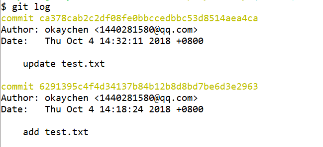

## git常见命令

每次更改后进行
     git add .   (ps: . 表示全部)
     git commit -m "update readme.md"
     git push  

git  init：初始化一个本地文件为git可以管理的仓库
ls -ah：可以帮你看到隐藏的.git文件
git  add：将修改提交到暂存区
git  commit -m <message>：（git  commit -m "write readme.txt"）将本次所有修改批量提交到分支
git status：将分支和当前本地仓库对比，时刻掌握当前仓库状态
git diff：将分支和当前本地仓库对比，输出修改的差异
git log：打印出提交的日志
git reset --hard HEAD^：版本回退上一个版本
（HEAD表示当前版本,HEAD^则表示上一版本，HEAD^^则是上上版本，HEAD~100表示往之前推的第100个版本）
        一。已经恢复上一版本，想重新恢复之前最新的版本，如何做？
                    
                情况1：如果你的命令行没有关闭，并且上面打印了commit的日志，
                    （我们可以通过commit id 的前几位来重新进行版本恢复：即git reset --hard  ca378c）
					
					
                  
                情况2：如果上面的情况很不凑巧，我们还有一种解决方案(如果我们想进行版本回退，其实是需要commit id，我们可以通过git reflog命令)
                  
				  	![][./images/2.png]
				  
git reflog：记录你的每一次命令
git checkout -- file：将文件在工作区的修改全部撤销，恢复到上次git add或git commit的状态（-- 很重要，没有它会变成切换到一个分支的命令）
git reset HEAD file：将暂存区的修改撤销，回退到工作区（即回退上一次ｇｉｔ　ａｄｄ）
git rm：从版本库种删除一个文件（删除之后记得git commit）

远程仓库：
    git  push：将当前分支master分支推送到远程（加-u的参数，还会将本地的master分支和远程的master关联起来 git  push  -u origin master）
    git remote add origin git@server-name:path/repo-name.git：关联一个远程库
  git clone：从远程库克隆
分支：  
  git checkout -b dev：新建一个名为dev的分支（-b表示创建并切换，相当于git branch dev和git checkout dev合并）
  git merge：用于合并指定分支到当前分支
  git branch -d dev：删除名为dev的分支
  git log --graph：可以看到分支合并图
 
  dev分支：团队协助分支
  feature分支：功能分支
  bug分支：bug记录分支

标签：
  git tag v1.0.0 commit-id：给指定某次提交打标签
  git show v1.0.0：展示标签为v1.0.0的commit信息
  git tag -d v1.0.0：删除标签
  git push origin v1.0.0：将创建的标签提交到远程
  git push origin --tags：将本地创建的标签全部提交到远程
  git push origin ：refs/tags/v1.0.0：从远程中删除到某个标签

